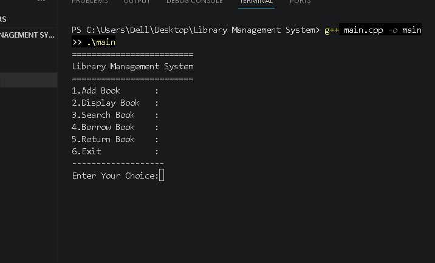
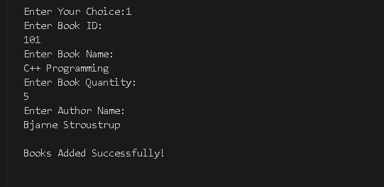
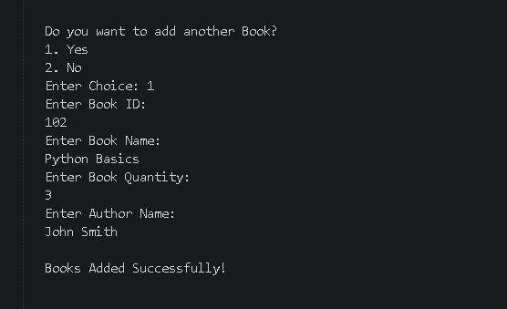
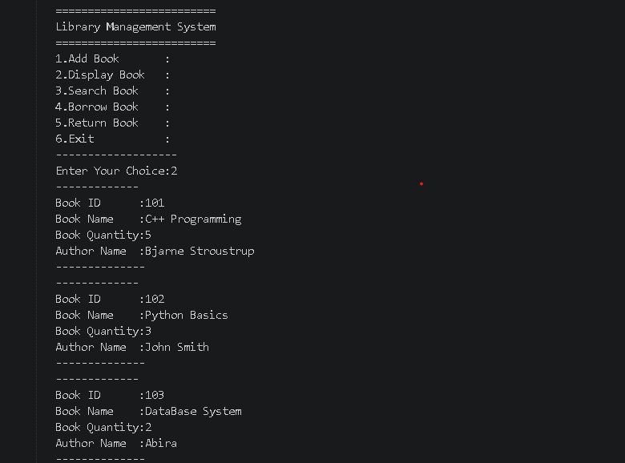
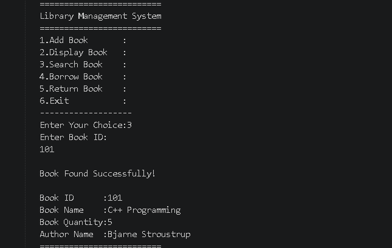
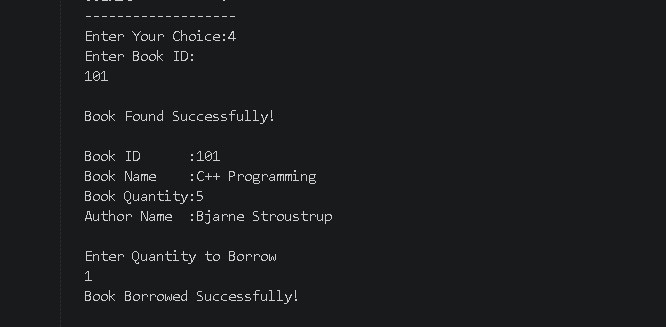
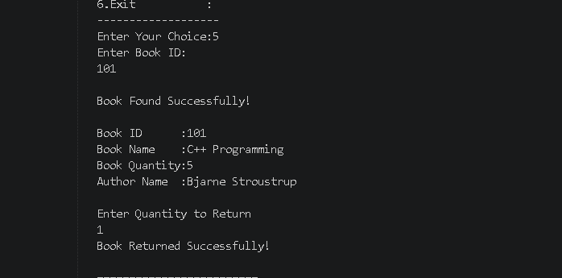

# Library Management System (C++)

## Overview

The Library Management System is a console-based application developed in C++ using Object-Oriented Programming (OOP) concepts and File Handling.

The system allows users to manage books by adding new books, displaying available books, searching books by ID, borrowing books, and returning books. Book records are stored permanently using a text file, so the data remains available even after the program is closed.

---

## Features

- Add new books
- Display all books
- Search books by Book ID
- Borrow books
- Return books
- Store records using File Handling
- Menu-driven interface
- Supports adding multiple books without restarting the program

---

## Technologies Used

- C++
- Object-Oriented Programming (OOP)
- File Handling
- Visual Studio Code
- Git & GitHub

---

## Project Structure

```
Library-Management-System-CPP
│
├── main.cpp
├── books.txt
├── images
│   ├── 01_Project03_HomeScreen.png
│   ├── ...
│
└── README.md
```

---

## How to Run

1. Clone the repository

```
git clone https://github.com/itsabira16445/Library-Management-System-CPP.git
```

2. Open the project in Visual Studio Code.

3. Compile the program.

```
g++ main.cpp -o main
```

4. Run the executable.

```
./main
```

or on Windows

```
main.exe
```

---

## Program Screenshots

### Main Menu



### First Book Added



### Second Book Added



### Display Books



### Search Book



### Borrow Book



### Return Book



---

## Challenges I Faced

While developing this project, I encountered several practical challenges:

- Working with File Handling for the first time.
- Reading and searching data from a text file.
- Using loops correctly for the menu system.
- Managing multiple book entries without restarting the program.
- Handling user input using both `cin` and `getline()`.
- Organizing the project repository and uploading it to GitHub.

Each challenge helped me improve my understanding of C++ and debugging techniques.

---

## What I Learned

Through this project, I strengthened my understanding of:

- Classes and Objects
- Encapsulation
- Functions
- File Handling
- Loops
- Switch Statements
- String Manipulation
- Basic Git and GitHub workflow

---

## How This Project is Different from My Previous Projects

Unlike my previous C++ projects, this project introduces **persistent data storage** using File Handling.

Earlier projects mainly focused on functions, and basic object-oriented programming. This project combines multiple concepts together, including:

- Object-Oriented Programming
- File Handling
- Menu-driven application
- Searching records
- Real-world library management operations

This makes it my most complete C++ project so far.

---

## Future Improvements

Possible improvements include:

- Update Book Information
- Delete Book Records
- Student Management
- Issue and Due Date System
- Fine Calculation
- Password Authentication
- Binary File Storage
- Better Input Validation

---

## Author

**Abira Adil**

GitHub: https://github.com/itsabira16445

---
